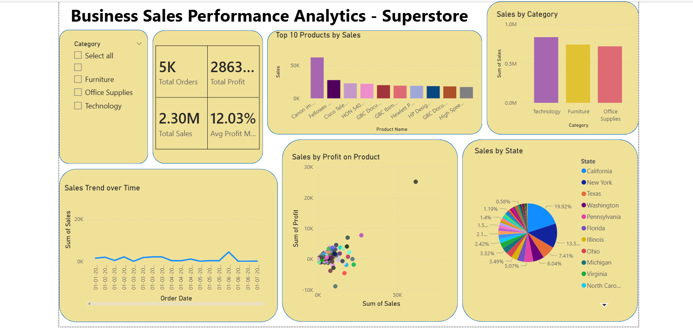

# FUTURE_DS_01

# 📊 Business Sales Performance Analytics – Superstore

## 🔍 Project Overview

This project focuses on analyzing business sales data using Power BI to understand performance trends, identify top-performing products, and uncover areas for improvement. The goal is to support data-driven decision-making for business growth.

---

## 🛠️ Tools & Technologies Used

* Power BI (Data Visualization)
* Excel / CSV Dataset
* Data Cleaning & Transformation
* DAX (Data Analysis Expressions)

---

## 📁 Dataset Description

The dataset used is the Superstore dataset, which includes:

* Order Date
* Product Name
* Category
* Sales
* Profit
* Region / State
* Quantity

---

## 📊 Dashboard Features

The dashboard includes the following key components:

* KPI Cards:

  * Total Sales (2.30M)
  * Total Profit (2863K approx.)
  * Total Orders (5K)
  * Average Profit Margin (12.03%)

* Visualizations:

  * Sales Trend over Time (Line Chart)
  * Sales by Category (Bar Chart)
  * Top 10 Products by Sales (Bar Chart)
  * Sales vs Profit by Product (Scatter Plot)
  * Sales by State (Distribution View)
  * Category Filter (Slicer)

---

## 🔍 Key Insights

* Technology category generates the highest sales among all categories.
* A few products show high sales but low or negative profit, indicating heavy discounting or cost issues.
* Sales trend shows fluctuations over time, suggesting seasonal or demand variation.
* Some states contribute significantly more to overall sales compared to others.

---

## 💡 Business Recommendations

* Focus on high-performing categories like Technology to maximize revenue.
* Reduce discounts or optimize pricing for low-profit products.
* Promote high-margin products to improve profitability.
* Expand business operations in top-performing states.

---

## 📸 Dashboard Preview

---

## 🚀 Conclusion

This project demonstrates how data analytics can help businesses understand performance, identify problems, and make informed decisions using Power BI.

---
